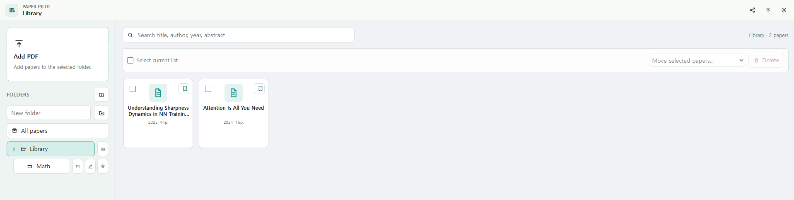
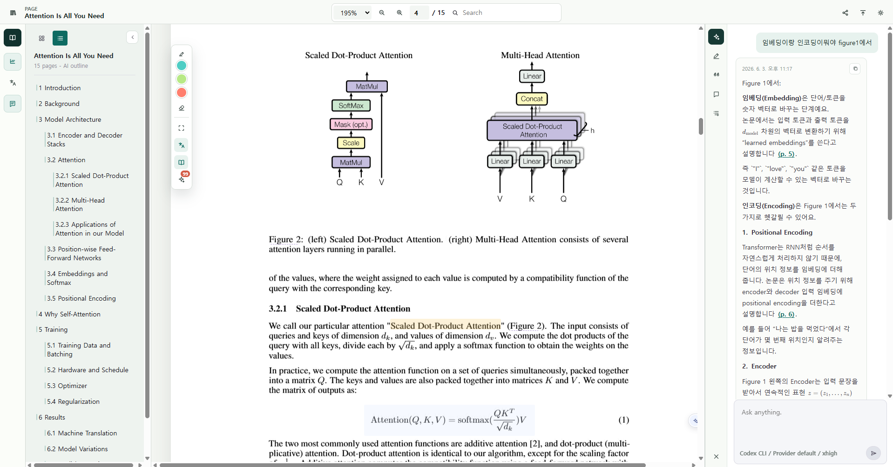
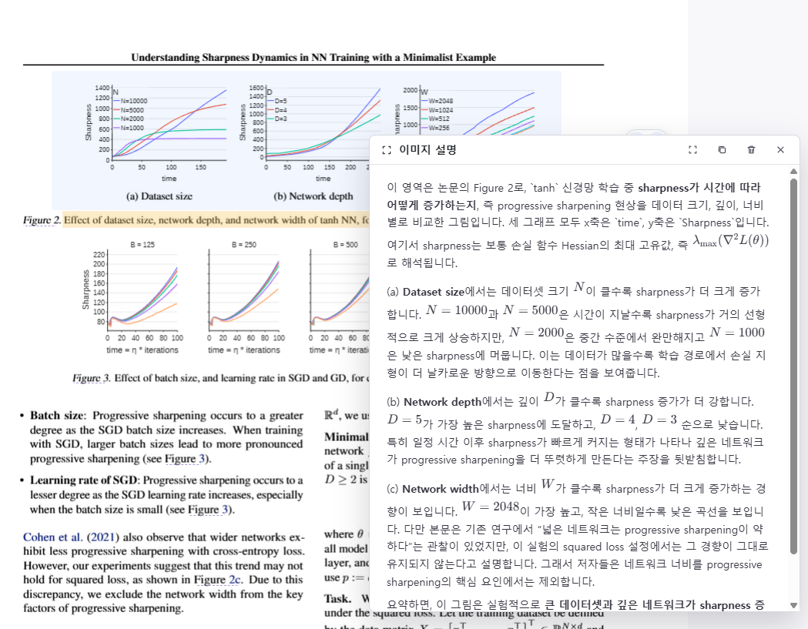

[한국어 README](docs/README.ko.md) · English

# Paper Pilot

Your papers. Your questions. Your margins. Your agent.

A local-first desktop reader that turns academic PDFs into a persistent research workspace. Every explanation, highlight, note, translation, and citation card stays attached to the paper that created it.


[한국어 README](docs/README.ko.md)

## 📸 See Paper Pilot In Action

### 📚 Library workspace



The library turns a folder of PDFs into a clean reading queue. Add papers into the selected folder, create nested folders like `Math`, search by title, author, year, or abstract, and manage each paper as a compact card with selection and bookmark controls. It is designed to move from collection management to reading without opening a separate citation manager first.

### 🧠 Reader, translation, and AI panel



The reader combines four panes in one workspace: an AI outline on the left, the original PDF in the center, a page-aligned translation sidecar, and an AI panel on the right. In the screenshot, Paper Pilot highlights a passage, translates the current page into Korean, extracts a keyword dictionary, generates a 3-line summary, keeps chat ready, and stores a document outline without leaving the paper.

### 🖼️ Visual explanation for figures and regions



Image explanation handles figures and cropped page regions. Select a plot, table, equation, or dense visual area and Paper Pilot sends the crop with surrounding paper context to the agent. The result explains what the visual is showing, preserves math notation, and connects the figure back to the paper's argument, which is especially useful when captions are not enough.

> Privacy note. Paper Pilot is built around local files and local state. AI providers only receive the context needed for the task you run, such as selected text, page excerpts, or an image crop. For unpublished papers, choose your agent provider deliberately.

Paper readers usually stop at rendering pages. AI chat usually forgets where the answer came from. Paper Pilot joins the two: the PDF remains the source of truth, while agent outputs become part of the paper's long-lived study record.

* * *

## 🧠 What Paper Pilot Means

Paper Pilot is not a generic document viewer with an AI button. It is a paper-reading workflow shaped around how research actually happens:

```text
Import papers -> Read in context -> Ask an agent -> Save the result -> Export when needed
```

The core idea is simple: a question about a paper should not disappear into a chat transcript. It should return to the paper as an explanation, highlight, note, citation reason, translation, or exportable artifact.

## ⚡ What Regular PDF Readers Can't Do

Most research tools split the work across too many places.

- PDF readers show the page but do not understand your question.
- Chat apps answer questions but lose the exact paper context.
- Citation managers store references but not why a reference matters.
- Translation tools translate text but detach it from the original page.
- Notes apps preserve thoughts but require manual linking back to the PDF.
- Many AI-first readers depend on direct model APIs, which can add separate usage costs, API key setup, and billing management before the reading workflow even starts.

Paper Pilot keeps those pieces together.

| Axis | Paper Pilot | Typical PDF + Chat Workflow |
| --- | --- | --- |
| Paper context | Page-aware, selection-aware, document-aware | Manually copied into chat |
| AI outputs | Saved beside the paper | Buried in a separate conversation |
| Highlights | Manual and agent-assisted | Manual only |
| Translation | Page sidecar attached to PDF | Detached text output |
| Citations | Reference cards with reasons and export | Separate manager, often no rationale |
| Storage | Local SQLite + local files | Split across apps |
| AI cost model | Works through selectable agent providers and local draft mode | Often requires a separate model API key and usage-based billing |
| Export | JSON/ZIP study bundle | Manual copy-paste |

## 🧭 The Reading Cycle

Paper Pilot keeps the reading loop short and visible:

| Step | Action | Saved output |
| --- | --- | --- |
| 1. Collect | Add PDFs and organize them into folders. | Library record |
| 2. Read | Use outline, zoom, search, translation, and highlights beside the PDF. | Page-aware reading state |
| 3. Ask | Send selected text, page context, or an image crop to an agent. | Explanation, summary, or answer |
| 4. Keep | Save useful results as highlights, notes, citation cards, or export bundles. | Persistent paper memory |

## 🔎 Local RAG for Paper Q&A

Paper Pilot grounds paper chat in the PDF you are reading.

When you ask a question, the app builds a local retrieval context from the extracted page text. It splits the paper into overlapping chunks, ranks them with BM25-style lexical scoring, and sends the strongest page excerpts with the agent task. The agent is then instructed to answer from those retrieved excerpts and cite pages inline.

This keeps paper Q&A closer to the source document:

- answers are based on retrieved PDF passages, not only model memory
- retrieved snippets keep page numbers and match scores
- weak matches are treated explicitly, so the agent can say when the PDF does not provide enough evidence
- no vector database is required for the local retrieval path

## 🤖 Agent Bridge

Paper Pilot does not hard-code one model provider into the interface. The app writes a structured task, a selected agent processes it, and the result is saved back into the local workspace.

```text
Paper context -> bridge task -> Codex CLI / Claude Code -> saved result -> reader update
```

This keeps the UI simple while leaving the agent layer replaceable.

Supported provider modes:

| Provider | Use it when |
| --- | --- |
| `codex-cli` | You want the default Codex CLI agent workflow. |
| `claude-code` | You already use Claude Code and want it to read papers. |
| `local-draft` | You want an offline UI demo or quick smoke check. |

## 🖥️ Workspace Tour

| Surface | Purpose |
| --- | --- |
| Library | Add PDFs, search papers, manage folders, bookmark important work. |
| Reader | Read with page navigation, zoom, detected outline, link previews, and text selection tools. |
| AI panel | Keep explanations, summaries, paper chat, highlights, citations, notes, and document info in one place. |
| Translation sidecar | Read translated page segments beside the original page. |
| Citation panel | Extract references, resolve links, write citation reasons, and copy BibTeX/CSV. |

## 🛠️ Under The Hood

| Layer | Stack |
| --- | --- |
| Desktop shell | Tauri 2 |
| UI | React 18 + TypeScript + Vite |
| PDF rendering | PDF.js |
| Math rendering | KaTeX |
| Local state | SQLite through Rust commands |
| Agent I/O | JSON queue under `bridge/` |
| Scholarly lookup | OpenAlex API |

Paper Pilot stores its working state locally. The Tauri backend handles PDF import, SQLite persistence, export bundles, and worker startup. The React UI handles reading, selection, panels, translation display, and agent task orchestration.

## 🚀 Install

### 🧩 Prerequisites

- Node.js 20+
- npm
- Rust stable toolchain
- Tauri 2 system prerequisites for your OS
- Optional: Codex CLI or Claude Code CLI for full agent execution

### 📥 Clone

```bash
git clone https://github.com/MinseobKimm/paper-pilot.git
cd paper-pilot
```

### 📚 Install dependencies

```bash
npm install
```

### 🖥️ Run the desktop app

```bash
npm run tauri:dev
```

### 🌐 Run a browser preview

```bash
npm run dev
```

Open `http://127.0.0.1:5174`.

The browser preview is useful for interface work. Native file storage, SQLite persistence, and worker execution are available in the Tauri desktop app.

## 📦 Build

```bash
npm run build
npm run tauri:build
```

The production executable is generated under:

```text
src-tauri/target/release/
```

## ✅ Check

```bash
npm test
npm run desktop:check
```

`npm test` runs the TypeScript and Vite build check. `npm run desktop:check` checks the Rust/Tauri backend.

## ⚙️ Provider Setup

Open **Settings** in Paper Pilot and choose a provider.

| Provider | Setup |
| --- | --- |
| Local draft | No setup required. |
| Codex CLI | Install Codex CLI and make sure `codex` is on `PATH`, or set `CODEX_BIN`. |
| Claude Code | Install Claude Code and make sure `claude` is on `PATH`, or set `CLAUDE_CODE_BIN`. |

The bridge folder defaults to:

```text
bridge/
  outbox/     task JSON files
  inbox/      result JSON files
  logs/       worker logs
```

## 📁 Repository Layout

```text
paper-pilot/
  src/                 React UI and reading workflow
  src/lib/             AI bridge, RAG, citations, scholarly lookup
  src-tauri/           Tauri backend, SQLite, worker commands
  docs/                Korean README and product screenshots
```

`bridge/`, `dist/`, release artifacts, QA captures, local PDFs, and agent outputs are runtime files. They are created locally and kept out of the repository.

## 📄 License

Paper Pilot is released under the [Apache License 2.0](LICENSE).

The license applies to the source code in this repository. Third-party libraries, AI providers, model outputs, and papers opened with Paper Pilot remain governed by their own licenses and terms.

## 🤝 Contributing

Pull requests are welcome. Useful areas include reader polish, provider adapters, citation workflows, installers, export formats, and library ergonomics.

Before opening a PR:

```bash
npm test
npm run desktop:check
```
