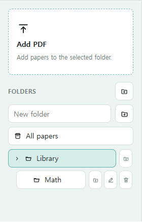
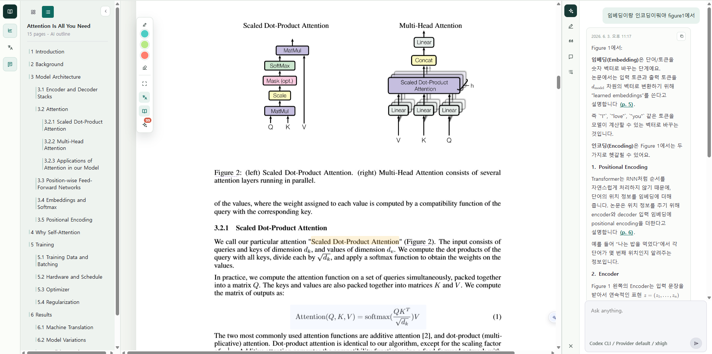
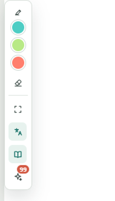

# Paper Pilot

Your papers. Your questions. Your margins. Your agent.

Paper Pilot is a local-first desktop reader for academic PDFs. It keeps the original paper, page-aware reading state, translations, highlights, notes, citation cards, and AI answers in one persistent workspace.


[Korean README](docs/README.ko.md)

## What It Does

Most PDF readers show pages. Most chat tools answer questions away from the paper. Paper Pilot joins the two: the PDF remains the source of truth, and every useful result can return to the paper as a saved study record.

```text
Import papers -> Read in context -> Ask an agent -> Save the result -> Export when needed
```

## Product Tour

### Library


Turn a folder of PDFs into a searchable reading queue. Add papers, create folders, bookmark important work, and edit title, authors, year, abstract, and folder metadata without leaving the app.

### Reader


Read the original PDF with outline navigation, page search, zoom, highlights, link previews, selection tools, and a persistent AI panel. Extracted page text, layout decisions, translations, word lists, zoom, and reading position are stored locally for faster return visits.

### Visual Explanation


Ask about a selected page region, figure, table, or equation. Paper Pilot sends only the task context needed by the selected agent and saves the answer back to the paper.

## Basic Usage

### Top Bar


- Library opens the paper library from anywhere in the app.
- Settings opens language, provider, translation, and display preferences.
- In Reader, Outline toggles the left outline panel and Translation toggles the sentence translation panel.
- Use the zoom selector, zoom buttons, page box, and search field to move around the PDF.
- Share exports a readable copy when an open paper has page images or rendered annotations available.
- Panel opens or closes the right workspace panel for AI, highlights, notes, and citations.

### Library Sidebar



- Add PDF imports papers into the selected folder.
- Create folders from the folder area, then select a folder to filter the library.
- Search filters papers by title, authors, year, abstract, and folder context.
- Open a paper from its card, bookmark important papers, and edit paper details from the library inspector.
- Select multiple papers when you want to move or delete them together.

### Reader Panels



- The left outline panel jumps to detected sections or pages. Switch between list and grid views depending on whether you want section titles or compact page navigation.
- The translation panel shows sentence-level Korean translation beside the current page. Use refresh when the page needs a new translation, and click a translated sentence to sync back to the PDF.
- The right panel has tabs for Study tools, Highlights, Quote cards, Notes, and Citations. Use Study for paper Q&A, Highlights for saved marks, Notes for Markdown notes, and Citations for reference extraction and export.

### PDF Tools



- Select text to open the quick toolbar: Explain, Highlight, Translate, Comment, or Copy.
- Use the floating reader tools to pick highlight colors, erase highlights, explain a drawn region, bookmark the current reading position, toggle auto translation, toggle word-meaning lookup, or build missing word meanings.
- Click page citations in AI answers to jump back to the cited page.

## Core Features

- Local-first paper workspace with SQLite state and local files.
- Page-aware text selection for single-column and two-column papers.
- Sentence-level Korean translation beside the original PDF page.
- Korean word meanings and technical-term popups built from paper context.
- AI explanations for selected text, page regions, figures, equations, and paper-level questions.
- Citation cards with reference extraction, link enrichment, rationale notes, and BibTeX/CSV export.
- Study export as local JSON/ZIP bundles.

## Ask AI Paper Q&A

Paper Pilot offers three paper chat modes:

| Mode | Best for | How it works |
| --- | --- | --- |
| `Auto` | Letting the selected agent choose the path | The agent rewrites the question in English and chooses Fast or Deep. |
| `Fast` | Quick, text-grounded questions | Uses PaperQA2-powered evidence search over Reader-indexed page text, then answers from retrieved evidence with page citations. |
| `Deep` | Equations, figures, tables, algorithms, layout-sensitive details, and complex cross-page reasoning | Gives the selected agent the original PDF path plus a compact document context pack for a full-paper pass. |

Fast mode is powered by [PaperQA2](https://github.com/Future-House/paper-qa), installed through the Python package `paper-qa>=5` in `requirements.txt`. It keeps answers tied to the page text that Paper Pilot has already indexed. When Fast evidence is thin, the answer is marked as evidence-limited and the reader can continue with Deep for a more complete pass.

## Privacy Model

Paper Pilot is built around local files and local state. AI providers receive only the context needed for the task you run, such as selected text, page excerpts, an image crop, or the original PDF path for Deep mode. For private or unpublished papers, choose the provider deliberately.

## Language Support

- Interface: English and Korean.
- Translation target: Korean.

## Install

### Prerequisites

- Node.js 20+
- npm
- Rust stable toolchain
- Tauri 2 system prerequisites for your OS
- Python 3.11+
- Codex CLI or Claude Code CLI for full agent execution

### Clone

```bash
git clone https://github.com/MinseobKimm/paper-pilot.git
cd paper-pilot
```

### Install App And Retrieval Dependencies

```bash
npm install
npm run setup:python
```

`npm run setup:python` runs `python -m pip install -r requirements.txt`. That installs PaperQA2 through `paper-qa>=5`, which Fast Q&A expects. On Windows, `py -3 -m pip install -r requirements.txt` is also fine when the Python launcher is configured for Python 3.11 or newer.

## Run

### Desktop App

```bash
npm run tauri:dev
```

### Browser Preview

```bash
npm run dev
```

Open `http://127.0.0.1:5174`. The browser preview is useful for interface work; native file storage, SQLite persistence, and worker execution are available in the Tauri desktop app.

## Build

```bash
npm run build
npm run tauri:build
```

The production executable is generated under:

```text
src-tauri/target/release/
```

## Check

```bash
npm test
npm run desktop:check
```

`npm test` runs the TypeScript and Vite build check. `npm run desktop:check` checks the Rust/Tauri backend.

## Provider Setup

Open Settings in Paper Pilot and choose a provider.

| Provider | Setup |
| --- | --- |
| Local draft | No external setup; useful for UI smoke checks. |
| Codex CLI | Install Codex CLI and make sure `codex` is on `PATH`, or set `CODEX_BIN`. |
| Claude Code | Install Claude Code and make sure `claude` is on `PATH`, or set `CLAUDE_CODE_BIN`. |

### Claude Code bridge

Paper Pilot calls Claude Code through the official non-interactive CLI path: `claude --print` with `--output-format stream-json`. The bridge captures the final `result`, stores the Claude session ID for follow-up paper chat, and writes the parsed response to `bridge/logs/*.response.md`.

For privacy and safety, the Claude Code bridge runs with `--permission-mode dontAsk`, restricts tools to `Read,Glob,Grep`, disables implicit MCP loading with `--strict-mcp-config`, and grants file access with `--add-dir` for the project and, in Deep PDF chat, the PDF's parent directory. Install and authenticate Claude Code first (`claude --version`, then `claude auth login` or your organization's supported authentication flow).

## Third-party Attribution

Paper Pilot integrates third-party projects as dependencies and keeps their licenses separate from this repository's source license.

- PaperQA2 / `paper-qa`: used by Fast Q&A for evidence retrieval. Source: [Future-House/paper-qa](https://github.com/Future-House/paper-qa). Package: [paper-qa on PyPI](https://pypi.org/project/paper-qa/). License: Apache License 2.0, copyright FutureHouse.
- PaperQA2 research citation: Skarlinski et al., "Language agents achieve superhuman synthesis of scientific knowledge", arXiv:2409.13740. Use the upstream [CITATION.cff](https://github.com/Future-House/paper-qa/blob/main/CITATION.cff) when publishing work that relies on PaperQA2 results.

Paper Pilot does not vendor PaperQA2 source code. It calls the installed Python package through the local retrieval adapter.

## License

Paper Pilot is released under the [Apache License 2.0](LICENSE).

This license applies to the source code in this repository. Third-party libraries, AI providers, model outputs, and papers opened with Paper Pilot remain governed by their own licenses and terms.
