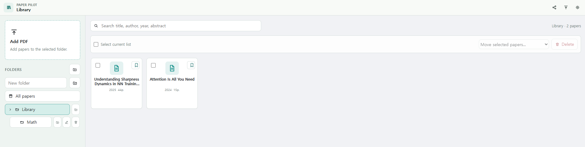
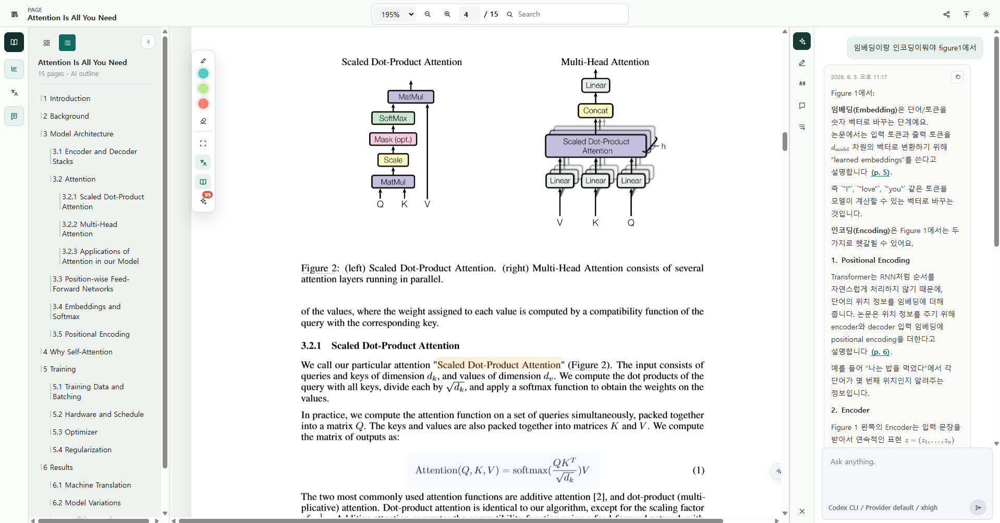
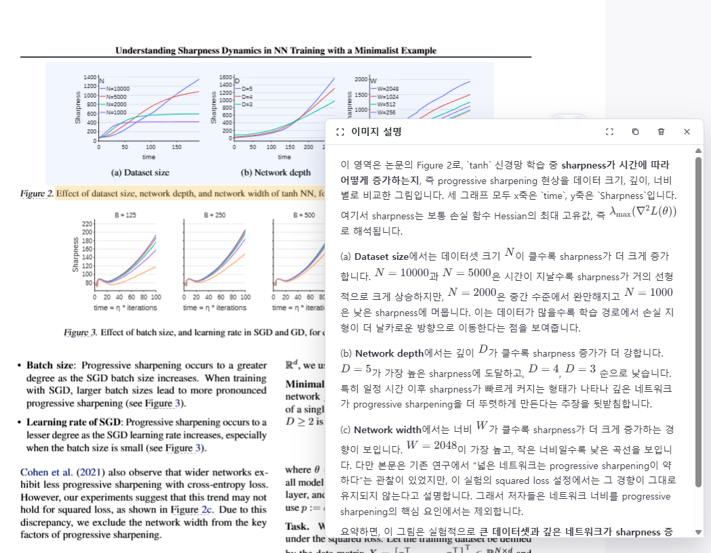
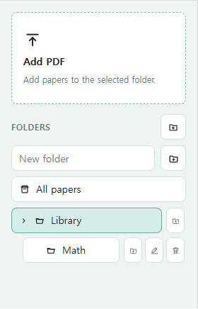
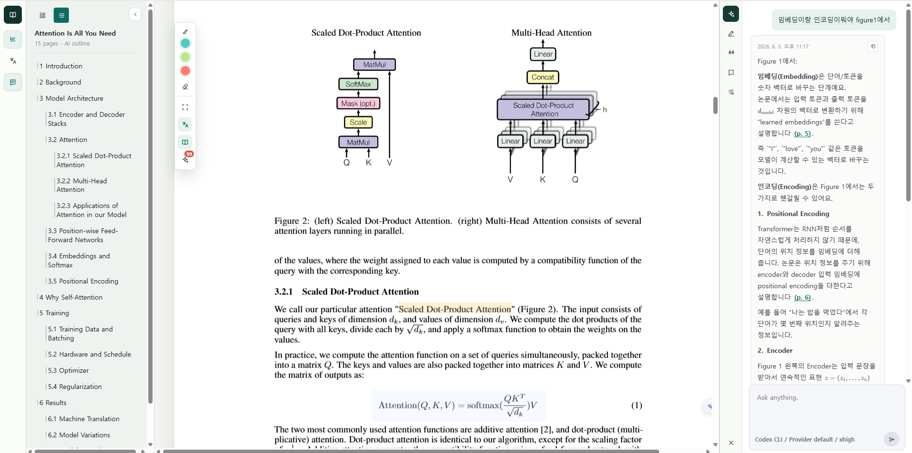
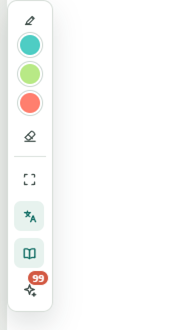

[English README](../README.md) · 한국어

# Paper Pilot

당신의 논문. 당신의 질문. 당신의 여백 메모. 당신의 agent.

Paper Pilot은 학술 PDF를 위한 local-first 데스크톱 리더입니다. 원문 PDF, 페이지별 읽기 상태, 번역, 하이라이트, 노트, 인용 카드, AI 답변을 하나의 오래 남는 연구 작업 공간에 묶어 둡니다.


[English README](../README.md)

## 무엇을 하는 앱인가

대부분의 PDF 리더는 페이지를 보여주는 데서 멈춥니다. 대부분의 채팅 도구는 답변을 논문 밖에서 처리합니다. Paper Pilot은 둘을 합칩니다. PDF는 계속 원본 근거로 남고, 유용한 결과는 다시 논문 옆의 학습 기록으로 돌아옵니다.

```text
논문 가져오기 -> 원문 읽기 -> agent에게 질문 -> 결과 저장 -> 필요할 때 내보내기
```

## 제품 둘러보기

### 라이브러리



PDF 폴더를 검색 가능한 독해 대기열로 바꿉니다. 논문을 추가하고, 폴더를 만들고, 중요한 논문을 북마크하고, 제목, 저자, 연도, 초록, 폴더 정보를 앱 안에서 수정할 수 있습니다.

### Reader



원문 PDF를 보면서 목차 이동, 페이지 검색, 확대/축소, 하이라이트, 링크 미리보기, 선택 도구, AI 패널을 함께 사용합니다. 추출된 페이지 텍스트, 레이아웃 판단, 번역, 단어 목록, 확대 비율, 읽던 위치는 로컬에 저장되어 다시 열 때 빠르게 돌아올 수 있습니다.

### 시각 자료 설명



선택한 페이지 영역, 그림, 표, 수식에 대해 질문할 수 있습니다. Paper Pilot은 선택된 agent에 필요한 작업 맥락만 전달하고, 답변을 다시 논문 기록으로 저장합니다.

## 기본 사용법

### 상단바


- Library 버튼은 앱 어디에서든 논문 라이브러리로 돌아갑니다.
- Settings 버튼은 언어, provider, 번역, 화면 표시 설정을 엽니다.
- Reader에서는 Outline 버튼으로 왼쪽 목차 패널을 열고 닫고, Translation 버튼으로 문장 번역 패널을 열고 닫습니다.
- 확대 비율 선택, 확대/축소 버튼, 페이지 번호 입력, 검색창으로 PDF 안에서 이동합니다.
- Share 버튼은 열린 논문의 페이지 이미지나 주석 렌더링이 준비되어 있을 때 읽기용 사본을 내보냅니다.
- Panel 버튼은 AI, 하이라이트, 노트, 인용을 다루는 오른쪽 작업 패널을 열고 닫습니다.

### 라이브러리 사이드바



- Add PDF는 Finder의 원본 PDF를 라이브러리에 연결합니다. 앱 내부에 PDF 사본을 만들지 않고 원본을 직접 읽습니다.
- 원본을 옮기거나 삭제해 경로가 끊기면, 라이브러리에서 열 때 같은 PDF의 새 위치를 선택할 수 있습니다. PDF 폴더는 별도로 백업하세요.
- 설정에서 로컬 Obsidian 보관함을 선택하고 자동 연동을 켜면 논문마다 Markdown 파일이 만들어집니다. Paper Pilot이 표시한 구역에 노트와 논문 정보를 반영하며, Obsidian에서 자유 작성 구역에 추가한 내용은 보존합니다. 기본값은 꺼짐입니다.
- 폴더 영역에서 폴더를 만들고, 폴더를 선택해 라이브러리를 필터링합니다.
- 검색창은 제목, 저자, 연도, 초록, 폴더 맥락으로 논문을 찾습니다.
- 논문 카드를 열어 Reader로 들어가고, 중요한 논문은 북마크하며, 라이브러리 inspector에서 논문 정보를 수정합니다.
- 여러 논문을 한 번에 옮기거나 삭제할 때는 다중 선택을 사용합니다.

### Reader 패널



- 왼쪽 목차 패널은 감지된 섹션이나 페이지로 이동합니다. 제목을 보고 싶으면 list view, 페이지를 촘촘히 보고 싶으면 grid view를 사용합니다.
- 번역 패널은 현재 페이지의 문장 단위 한국어 번역을 원문 옆에 보여줍니다. 새 번역이 필요하면 refresh를 누르고, 번역 문장을 클릭하면 PDF의 해당 문장과 동기화됩니다.
- 오른쪽 패널에는 Study tools, Highlights, Quote cards, Notes, Citations 탭이 있습니다. Study는 논문 Q&A, Highlights는 저장한 표시, Notes는 Markdown 노트, Citations는 참고문헌 추출과 내보내기에 사용합니다.

### PDF 도구



- 텍스트를 선택하면 빠른 툴바가 열립니다. Explain, Highlight, Translate, Comment, Copy를 바로 실행할 수 있습니다.
- 떠 있는 Reader 도구로 하이라이트 색 선택, 하이라이트 지우기, 영역 설명, 현재 위치 북마크, 자동 번역, 단어 뜻 조회, 누락 단어 뜻 생성을 사용할 수 있습니다.
- AI 답변 안의 페이지 인용을 클릭하면 해당 PDF 페이지로 이동합니다.

## 핵심 기능

- SQLite와 로컬 파일을 사용하는 local-first 논문 작업 공간.
- single-column, two-column 논문을 고려한 페이지별 텍스트 선택.
- 원문 PDF 페이지 옆에 붙는 문장 단위 한국어 번역.
- 논문 맥락을 반영한 한국어 단어 뜻과 전문 용어 팝업.
- 선택 텍스트, 페이지 영역, 그림, 수식, 논문 전체 질문에 대한 AI 설명.
- 참고문헌 추출, 링크 보강, 인용 이유 메모, BibTeX/CSV 내보내기를 지원하는 인용 카드.
- JSON/ZIP 형태의 로컬 학습 번들 export.

## arXiv 탐색과 온라인 정보 연결

상단바의 **arXiv** 또는 라이브러리의 **arXiv 논문 탐색**을 엽니다. 키워드, `au:저자 이름`, arXiv URL/ID로 검색할 수 있으며 구형 ID와 특정 버전도 지원합니다. 최신 피드는 최근 7일이 기본입니다. 필터를 기억하고, 페이지 이동 중에는 기준 시각을 유지합니다. 새로고침하면 기준 시각을 갱신합니다.

**PDF 가져오기**에서 저장 위치를 선택하면 PDF를 검증해 등록하고 리더를 엽니다. 다운로드 취소·재시도를 지원하며, 중복 논문이나 파일은 기존 원본 경로를 유지합니다. 새로운 버전은 별도 문서로 가져옵니다.

**문서 정보 → 온라인 논문 정보**에서 후보의 식별자와 서지정보를 비교하고 적용할 필드만 선택합니다. 연결을 해제해도 적용된 서지정보는 유지합니다. **라이브러리 전체 검사**는 미연결 문서의 후보만 수집하며 자동 연결하지 않습니다. 작업과 후보를 저장하고, 실행 중 중단된 검사는 재실행 후 사용자가 재개합니다. 연결된 논문에서는 관련 논문·참고문헌·피인용 목록을 출처와 조회 시각과 함께 확인할 수 있습니다.

매칭에 필요한 PDF 앞부분 최대 5페이지는 로컬에서 읽습니다. arXiv/OpenAlex에는 식별자와 검색용 서지정보만 전달합니다. 응답은 24시간 캐시하며 네트워크 실패 시 오래된 캐시도 표시합니다. OpenAlex는 제한된 익명 조회를 지원하고, 설정에서 추가한 선택적 API 키는 macOS Keychain에 저장합니다. 온라인 연동은 데스크톱 앱에서 사용할 수 있습니다.

## Ask AI 논문 Q&A

논문 채팅은 항상 선택된 agent에 원본 PDF 경로와 간결한 문서 컨텍스트 팩을 전달합니다. Agent가 원문을 직접 확인하고 페이지를 인용하며, 이전 답변이 논문과 충돌하면 원문을 우선해 정정합니다.

세션은 논문별로 저장되고 앱을 재시작해도 이어집니다. **새 대화**를 누르면 이전 기록을 보존하면서 새 세션을 시작합니다. 시간이나 질문 횟수에 따른 자동 초기화는 없습니다. 저장된 세션이 없거나 유효하지 않으면 새 대화로 한 번 재시도합니다. 현재 논문의 답변을 기다리는 동안 추가 전송과 새 대화는 비활성화됩니다.


## 개인정보와 로컬 상태

Paper Pilot은 로컬 파일과 로컬 상태를 중심으로 동작합니다. AI provider에는 사용자가 실행한 작업에 필요한 맥락만 전달됩니다. 예를 들어 선택 텍스트, 페이지 excerpt, 이미지 crop, 논문 채팅의 원본 PDF 경로가 포함될 수 있습니다. 비공개 또는 미공개 논문을 읽을 때는 사용할 provider를 신중하게 선택하세요.

## 언어 지원

- 인터페이스: 영어와 한국어.
- 번역 대상 언어: 한국어.

## 설치

### 사전 준비

- Node.js 20+
- npm
- Rust stable toolchain
- 사용 중인 OS에 맞는 Tauri 2 system prerequisites
- Python 3.11+
- 전체 agent 실행을 위한 Codex CLI 또는 Claude Code CLI

macOS에서는 macOS 13.3 이상을 지원합니다. Homebrew를 사용한다면 빌드 도구를 다음과 같이 설치할 수 있습니다.

```bash
brew install node rust python@3.12
```

### Clone

```bash
git clone https://github.com/MinseobKimm/paper-pilot.git
cd paper-pilot
```

### 앱과 retrieval 의존성 설치

```bash
npm install
npm run setup:python
```

`npm run setup:python`은 격리된 Python 환경을 만들고 PaperQA2를 `paper-qa>=5`로 설치합니다. macOS에서는 Finder에서 실행한 앱도 Python을 안정적으로 찾도록 `~/Library/Application Support/local.paper-pilot.reader/python`에 환경을 저장합니다. `requirements.txt`를 변경한 뒤에는 이 명령을 다시 실행하세요.

## 실행

### 데스크톱 앱

Mac에서는 프로젝트 루트의 `Paper Pilot Dev.command`를 더블클릭해도 실행할 수 있습니다. 앱이 열리면 실행용 터미널 창은 자동으로 닫히고, 개발 서버는 백그라운드에서 계속 동작합니다. 프런트엔드는 소스 변경 시 바로 갱신되고, Rust 백엔드 변경 시 Tauri가 다시 컴파일합니다. 실행 로그는 `.dev-run/dev.log`에 저장됩니다.

```bash
npm run tauri:dev
```

### 브라우저 프리뷰

```bash
npm run dev
```

브라우저에서 `http://127.0.0.1:5174`를 엽니다. 브라우저 프리뷰는 UI 작업에 유용합니다. Native file storage, SQLite persistence, worker execution은 Tauri 데스크톱 앱에서 사용할 수 있습니다.

## 빌드

```bash
npm run build
npm run tauri:build
```

Mac에서 네이티브 앱을 만들고 기본 앱용 `release/Paper Pilot.app`을 업데이트하려면 다음 명령을 실행합니다. 앱이 실행 중이면 종료한 뒤 다시 열어 새 빌드를 사용하세요.

```bash
npm run build:mac
```

DMG가 필요하면 `npm run build:mac:dmg`를 별도로 실행합니다.

프로덕션 실행 파일은 아래 경로에 생성됩니다.

```text
src-tauri/target/release/
```

macOS 결과물은 다음 위치에 생성됩니다.

```text
release/Paper Pilot.app
src-tauri/target/release/bundle/macos/Paper Pilot.app
src-tauri/target/release/bundle/dmg/Paper Pilot_<version>_<architecture>.dmg
```

`.app`과 `.dmg`는 빌드 시점의 고정본입니다. 소스 수정 사항을 반영하려면 `npm run build:mac`을 다시 실행하세요.

Mac의 기본 PDF 앱으로 사용하려면 Finder에서 PDF 하나를 선택해 `정보 가져오기(⌘I) → 다음으로 열기 → 기타…`에서 `release/Paper Pilot.app`을 선택하고 `모두 변경`을 누릅니다. Finder에서 PDF를 열면 앱의 라이브러리로 가져와 Reader에 표시하고, 이미 가져온 파일이면 기존 항목을 엽니다. 개발용 `.command` 바로가기는 기본 앱 선택 대상이 아닙니다.

로컬 빌드는 ad-hoc 서명을 사용합니다. 다른 Mac에 배포할 때 Gatekeeper 경고를 없애려면 Apple Developer 서명 인증서와 공증 설정이 필요합니다.

## 체크

```bash
npm test
npm run desktop:test
npm run test:scholarly
python3 -m unittest discover -s retrieval-adapter -p 'test_*.py'
```

`npm test`는 TypeScript와 Vite build check를 실행합니다. `npm run desktop:test`는 Rust/Tauri backend 테스트를 실행합니다. Python 명령은 페이지 기반 검색과 로컬 fallback을 검증합니다.

## Provider 설정

Paper Pilot의 Settings에서 provider를 선택합니다.

| Provider | 설정 |
| --- | --- |
| Local draft | 외부 설정이 필요 없으며 UI smoke check에 유용합니다. |
| Codex CLI | Codex CLI를 설치하고 `codex`가 `PATH`에 잡히게 하거나 `CODEX_BIN`을 지정합니다. macOS에서는 Codex 또는 ChatGPT 앱에 포함된 CLI도 자동 감지합니다. |
| Claude Code | Claude Code를 설치하고 `claude`가 `PATH`에 잡히게 하거나 `CLAUDE_CODE_BIN`을 지정합니다. |

### Claude Code bridge

Paper Pilot은 Claude Code의 공식 비대화형 CLI 경로인 `claude --print`와 `--output-format stream-json`을 사용합니다. 브릿지는 최종 `result`를 캡처하고, 후속 paper chat을 위해 Claude session ID를 저장하며, 파싱된 응답을 `bridge/logs/*.response.md`에 남깁니다.

개인정보와 안전을 위해 Claude Code bridge는 `--permission-mode dontAsk`로 실행하고, 도구를 `Read,Glob,Grep`로 제한하며, `--strict-mcp-config`로 암묵적 MCP 로딩을 끕니다. 파일 접근은 `--add-dir`로 프로젝트 디렉터리와 Deep PDF chat에서 PDF 상위 디렉터리만 허용합니다. 먼저 Claude Code를 설치하고 인증하세요(`claude --version`, 이후 `claude auth login` 또는 조직의 인증 방식).

## Third-party Attribution

Paper Pilot은 third-party 프로젝트를 의존성으로 통합하며, 각 프로젝트의 라이선스는 이 저장소의 소스 라이선스와 별도로 유지됩니다.

- PaperQA2 / `paper-qa`: 독립된 이전 retrieval adapter에 사용합니다. Source: [Future-House/paper-qa](https://github.com/Future-House/paper-qa). Package: [paper-qa on PyPI](https://pypi.org/project/paper-qa/). License: Apache License 2.0, copyright FutureHouse.
- PaperQA2 연구 인용: Skarlinski et al., "Language agents achieve superhuman synthesis of scientific knowledge", arXiv:2409.13740. PaperQA2 결과에 의존한 작업을 출판하거나 공개할 때는 upstream [CITATION.cff](https://github.com/Future-House/paper-qa/blob/main/CITATION.cff)를 따르세요.

Paper Pilot은 PaperQA2 소스 코드를 vendoring하지 않습니다. 로컬 retrieval adapter를 통해 설치된 Python 패키지를 호출합니다.

## 라이선스

Paper Pilot은 [Apache License 2.0](../LICENSE)으로 공개됩니다.

이 라이선스는 이 저장소의 소스 코드에 적용됩니다. Paper Pilot에서 사용하는 third-party libraries, AI providers, model outputs, 사용자가 여는 논문과 PDF는 각각의 라이선스와 이용약관을 따릅니다.
